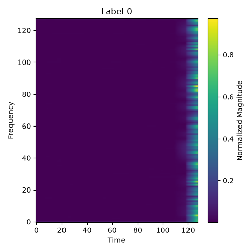
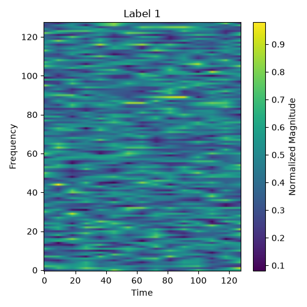
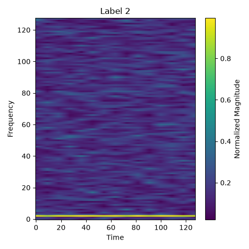

# RF Signal Classification using Deep Learning
### Project Overview & Journal

---

## Objective

The goal of this project is to build a system that can listen to the radio frequency spectrum in real time and automatically identify what type of signal it is hearing,without any human intervention. Given a raw stream of IQ samples from a software-defined radio dongle, the system should classify the signal into one of several known categories with high confidence.

This sits at the intersection of signal processing and deep learning. Rather than hand-crafting features from the RF spectrum, we let convolutional neural networks learn directly from the data, either from the raw time-domain waveform or from a visual time-frequency representation of it.

---

## What the System Does

At a high level:

1. An RTL-SDR dongle captures IQ samples from the air at a chosen frequency
2. Those samples are preprocessed into a format the model understands
3. A trained CNN classifies the signal into one of the known categories
4. The prediction is returned with a confidence score

The system can also be run offline on pre-recorded `.npy` files for evaluation and experimentation.

### Signal Classes

| Class | Description |
|---|---|
| ADS_B | Aircraft transponder signals (1090 MHz) |
| FM_broadcast | Commercial FM radio (88–108 MHz) |
| ISM_sensors | Industrial/scientific/medical band devices (433/868/915 MHz) |
| noise | Background RF noise / no signal |

---

## Dataset

The dataset utlized was the [TrevTron/rtl-ml-dataset](https://huggingface.co/datasets/TrevTron/rtl-ml-dataset) along with simulations generated on Simulink and signals collected using an RTL-SDR dongle across multiple capture sessions. Each recording is stored as a `.npy` file containing a dict with the raw complex IQ samples and capture metadata (center frequency, sample rate, timestamp, label).

```
data/datasets_validated/
├── ADS_B/          — 160 recordings
├── FM_broadcast/   — 160 recordings  (multiple FM stations: 91.1, 93.5, 95.0, 98.3, 104.8, 106.4 MHz)
├── ISM_sensors/    — 160 recordings
└── noise/          — 160 recordings  (captured across 50, 300, 470, 800, 1200 MHz)
```

All recordings are split stratified per class: **70% train / 10% validation / 20% test**. The split is done at the recording level so windows from the same capture never appear in both train and test.

---

## The Two Models

Two independent CNN architectures were trained and evaluated. They share the same training loop, optimizer, loss function, and evaluation pipeline — the only difference is how the raw IQ data is represented before entering the network.

### Model 1D — SignalCNN

Operates directly on the raw IQ time series. Each 2048-sample window is split into two channels (I and Q) and fed into a stack of 1D convolutions. The network learns temporal patterns in the waveform itself.

- Input: `[B, 2, 2048]` — 2 channels (I/Q), 2048 time steps
- 3 × Conv1d blocks with shrinking kernels (9→7→5) + BatchNorm + ReLU + MaxPool1d(4)
- AdaptiveAvgPool1d → Flatten → Dropout(0.3) → Linear classifier
- Trained on: ADS_B, FM_broadcast, ISM_sensors, noise (4 classes)

### Model 2D — SpectrogramCNN

Converts each IQ window into a 128×128 spectrogram image using STFT, then applies 2D convolutions. The network learns patterns in the time-frequency domain — the same representation a human would look at in a spectrum analyser.

- Input: `[B, 1, 128, 128]` — single-channel spectrogram image
- 4 × Conv2d blocks (1→32→64→128→256) + BatchNorm + ReLU + MaxPool2d(2)
- AdaptiveAvgPool2d → Flatten → Dropout(0.3) → Linear classifier
- Trained on: ADS_B, FM_broadcast, ISM_sensors, NOAA_weather, noise (5 classes)

---

## Spectrograms

The 2D model works by converting each IQ window into a spectrogram — a 2D image where the x-axis is time, the y-axis is frequency, and pixel brightness represents signal power. These are generated using a short-time Fourier transform (STFT) with a 256-sample Hann window, log-compressed, min-max normalised, and resized to 128×128.

Each signal class has a visually distinct spectrogram signature:

**ADS_B** — short sharp bursts, sparse in time

**FM_broadcast** — wide continuous band, dense and uniform

**ISM_sensors** — narrow intermittent pulses

**noise** — flat, diffuse, no structure

<!-- Attach spectrogram images below -->
| ADS_B | FM_broadcast | ISM_sensors | noise |
|---|---|---|---|
|  |  |  |  |

---

## SDR Interaction

The RTL-SDR dongle is the hardware interface between the physical RF environment and the software pipeline. It is a low-cost USB receiver that can tune across roughly 24 MHz to 1.7 GHz and stream raw IQ samples to the host machine.

`live_capture.py` handles all SDR interaction:
- Configures center frequency, sample rate (default 1,024,000 Hz), and gain
- Reads IQ samples in chunks to avoid USB buffer overflows
- Wraps captures in a metadata dict and saves as `.npy` — the exact same format as the training dataset

<!-- Attach SDR live feed screenshot below -->
> 
> 


To capture a sample and run inference:

```bash
# Capture 512k samples at 1090 MHz (ADS-B)
python src/live_capture.py 1090000000 --num-samples 512000 --output predict_samples/live.npy

# Run 1D model inference
cd src && python -m model_1d.predict

# Run 2D model inference
cd src && python -m model_2d.predict_2d
```

---

## Results

### Model 1D — SignalCNN (4 classes)

| Metric | Score |
|---|---|
| Test Accuracy | **99.95%** |
| Macro Precision | 99.95% |
| Macro Recall | 99.95% |
| Macro F1 | 99.95% |
| Test Loss | 0.0029 |

```
              precision    recall  f1-score   support

       ADS_B       1.00      1.00      1.00      2111
FM_broadcast       1.00      1.00      1.00      2000
 ISM_sensors       1.00      1.00      1.00      2298
       noise       1.00      1.00      1.00      1848

    accuracy                           1.00      8257
```

<!-- Attach 1D confusion matrix below -->
> 

---

### Model 2D — SpectrogramCNN (5 classes)

| Metric | Score |
|---|---|
| Test Accuracy | **95.51%** |
| Macro Precision | 95.56% |
| Macro Recall | 95.51% |
| Macro F1 | 95.52% |
| Test Loss | 0.1232 |

```
              precision    recall  f1-score   support

       ADS_B       1.00      0.99      0.99      1500
FM_broadcast       0.98      0.95      0.97      1500
 ISM_sensors       0.99      1.00      0.99      1500
       noise       0.90      0.91      0.91      1500

    accuracy                           0.96      7500
```
---

### Model Comparison

| | 1D SignalCNN | 2D SpectrogramCNN |
|---|---|---|
| Classes | 4 | 5 |
| Test Accuracy | 99.95% | 95.51% |
| Macro F1 | 99.95% | 95.52% |
| Input | Raw IQ waveform | STFT spectrogram |
| Preprocessing cost | Low | Higher (STFT per window) |
| Strengths | Near-perfect on clean signals | Handles more classes, human-interpretable |
| Weaknesses | Fewer classes trained | singals/noise confusion |

The 1D model achieves near-perfect accuracy on its 4-class problem. The 2D model trades a small accuracy drop for an additional class and a more interpretable input representation.

---

## Tech Stack

| Component | Library / Tool |
|---|---|
| Deep learning framework | PyTorch >= 2.1.0 |
| Signal processing | SciPy >= 1.11.0 |
| Numerical computing | NumPy >= 1.24.0 |
| ML metrics & evaluation | scikit-learn >= 1.3.0 |
| Plotting | Matplotlib >= 3.7.0, Seaborn >= 0.12.0 |
| SDR hardware interface | pyrtlsdr >= 0.3.0 |
| Notebooks | ipykernel >= 6.25.0 |
| Progress bars | tqdm >= 4.65.0 |
| Hardware | RTL-SDR USB dongle |
| Python | 3.11+ |

---

## File Reference

```
RF-Signal-Classification-using-Deep-Learning/
├── src/
│   ├── dataset.py              — data loading and label mapping
│   ├── live_capture.py         — RTL-SDR capture interface
│   ├── live_classifier.py      — live prediction from SDR stream
│   ├── model_1d/               — 1D CNN pipeline
│   └── model_2d/               — 2D CNN pipeline
├── data/datasets_validated/    — training dataset (.npy per recording)
├── models/                     — saved checkpoints
├── results/                    — evaluation outputs, confusion matrices, spectrograms
├── predict_samples/            — .npy files for ad-hoc inference
├── notebooks/                  — Jupyter experiment notebooks
├── cnn.md                      — detailed CNN architecture & pipeline reference
└── README.md                 — this file
```